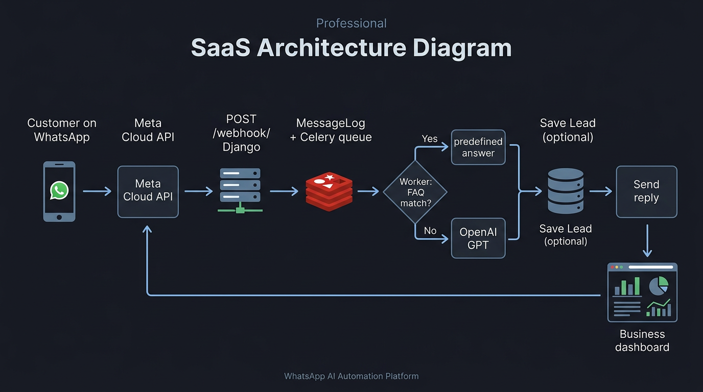

# WhatsApp AI Automation Platform — Architecture & Workflow

High-level view of how the system works end-to-end, plus a diagram you can use in docs or slides.

## Workflow diagram

*Image file (same repo): [`docs/whatsapp-ai-platform-workflow.png`](whatsapp-ai-platform-workflow.png)*

---

## End-to-end workflow (step by step)

### A. One-time setup (business + Meta)

1. **Business signs up** on your site → Django creates an **`accounts.User`** (business name, email, password).
2. In **Meta Developer** you create/configure the **WhatsApp Cloud API** app, phone number, webhook URL, verify token, and (optionally) note the **App Secret** for signatures.
3. In **Django Admin** (or your future Settings UI) the business sets:
   - **`whatsapp_phone_number_id`** (from Meta)
   - **`whatsapp_token`** (Cloud API access token)
   - **`api_key`** (OpenAI key), or you use a global **`OPENAI_API_KEY`** in `.env`
4. **Webhook URL** in Meta points to your server:  
   `https://your-domain.com/webhook/`  
   **Verify token** must match **`WHATSAPP_VERIFY_TOKEN`** in `.env`.

---

### B. When a customer sends a WhatsApp message

5. **WhatsApp (Meta)** receives the message and **POSTs** a JSON payload to **`/webhook/`**.
6. **GET** on the same path is used only for Meta’s **webhook verification** (`hub.verify_token` vs your env).
7. **POST** handler (`messaging/webhook_views.py`):
   - Optionally checks **`X-Hub-Signature-256`** using **`META_APP_SECRET`**.
   - Reads **`metadata.phone_number_id`** and finds the **User** whose **`whatsapp_phone_number_id`** matches → that’s the **business** for this chat.
   - Parses **from** (phone), **text**, **timestamp**.
   - Creates/updates **`Conversation`**, creates **`MessageLog`** (`status=received`), stores raw payload.
   - Enqueues **`process_incoming_message.delay(log.id)`** → **Celery** (backed by **Redis**).

---

### C. Background worker (the “brain”)

8. **Celery worker** runs **`process_incoming_message`** (`messaging/tasks.py`):
   - Sets log to **processing**.
   - **FAQ first:** tries to match inbound text to that business’s **`FAQ`** rows (`faqs/matching.py`).
   - **If match:** reply = FAQ **answer** (no OpenAI).
   - **If no match:** calls **`ai_engine/services.py`** → **OpenAI** with your prompt; model returns **reply text**, **intent**, and optional **lead** fields (name / phone / interest).
   - Writes **`MessageLog.outbound_response`**, sets **responded** (or **failed** on error).
   - If there’s enough lead info, creates a **`Lead`** row.
   - Enqueues **`send_whatsapp_reply.delay(...)`** to send the message via Meta’s API.

---

### D. Sending the reply

9. **`send_whatsapp_reply`** calls Meta’s **Graph API** (`messaging/whatsapp.py`) with the business’s **token** and **phone_number_id**.
10. Customer sees the **automated reply** in WhatsApp.

---

### E. What the business sees in your app

11. **Dashboard** (`/dashboard/`): counts **messages** and **leads**, shows recent **`MessageLog`** (often via React + `/api/messages/`).
12. **FAQs** (`/faqs/`): CRUD via **`/api/faqs/`** → stored per business.
13. **Leads** (`/leads/`): reads **`/api/leads/`** (AI-captured rows).
14. **JWT** (`/api/auth/token/`) for API clients; **session** for browser login.

---

### F. How pieces map to folders

| Piece | App / area |
|--------|------------|
| Users, business fields, tokens | `accounts/` |
| Landing + dashboard pages | `dashboard/` |
| Webhook, logs, Celery, WhatsApp send | `messaging/` |
| OpenAI prompts + calls | `ai_engine/` |
| FAQ CRUD + matching | `faqs/` |
| Lead model + API | `leads/` |

---

## Related docs

- Root **[README.md](../README.md)** — setup, env vars, static files, production notes.
